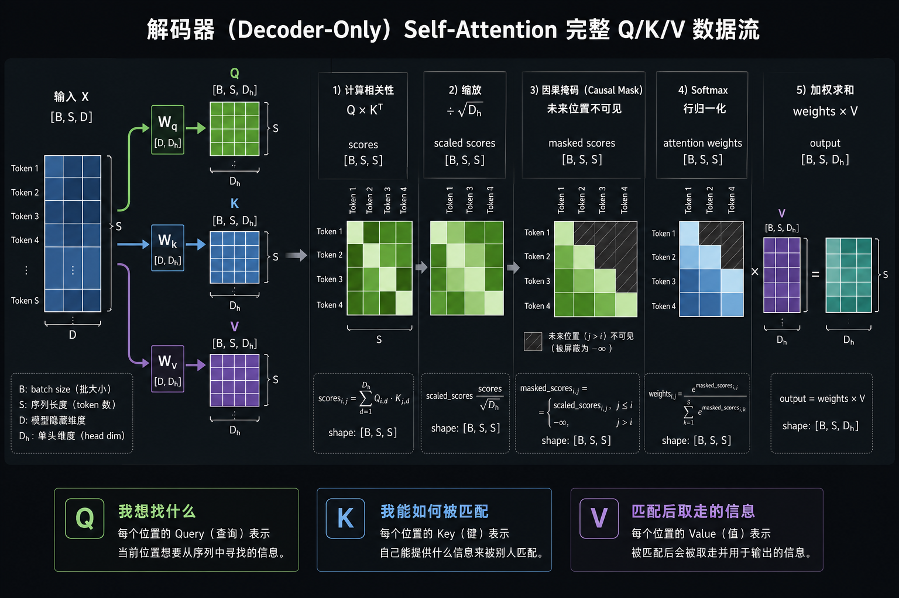

# Q、K、V 与 Scaled Dot-Product Attention

> Day 06 学习材料。目标不是背诵名词，而是能从 shape 和矩阵运算解释：
> 一个 token 如何从历史 token 中选择并聚合信息。

## 1. Attention 解决什么问题

截至 Day 05，我们的 `TinyLM` 只有：

```text
token ID → Embedding → LM Head
```

每个位置的 embedding 只由该位置自己的 token ID 决定。即使输入是：

```text
“小明把书放到桌上，因为它很重”
```

“它”的向量也无法读取“小明”“书”“桌上”等前文信息。

Self-Attention 增加了一种能力：

> 每个 token 可以根据当前需求，从可见 token 中挑选信息并做加权聚合。

对于 decoder-only 语言模型，“可见”还必须满足因果约束：位置 `i` 只能读取 `0..i`，
不能偷看未来 token。

## 2. 核心公式

输入 hidden states：

```text
X: [B, S, D]
```

单个 Attention head 的三组投影：

```text
Q = XWq    [B, S, Dh]
K = XWk    [B, S, Dh]
V = XWv    [B, S, Dh]
```

Scaled Dot-Product Attention：

```text
Attention(Q, K, V) = softmax(QKᵀ / sqrt(Dh)) V
```



读图顺序是从左到右：`X` 分别投影为 Q/K/V；Q 与 K 做两两匹配；
缩放并屏蔽未来位置后得到注意力权重；最后用权重聚合 V。

完整 shape 流：

```text
Q                         [B, S, Dh]
K.transpose(-2, -1)       [B, Dh, S]
Q @ Kᵀ                    [B, S, S]
/ sqrt(Dh)                [B, S, S]
+ causal mask             [B, S, S]
softmax(dim=-1)           [B, S, S]
probs @ V                 [B, S, Dh]
```

数学记号通常写 `XWq`；PyTorch 的 `nn.Linear(D, Dh)` 保存 `[Dh, D]` 权重，
实际计算等价于 `X @ weight.T`。两者只是权重记号方向不同，不是两套算法。

## 3. Q、K、V 分别是什么

| 角色 | 含义 | 检索类比 |
|---|---|---|
| Query（Q） | 当前 token 想寻找什么 | 搜索关键词 |
| Key（K） | 每个 token 可以怎样被匹配 | 文档索引标签 |
| Value（V） | 匹配后真正取走的信息 | 文档正文 |

过程可拆成两件事：

1. `QKᵀ` 只负责决定“看谁、看多少”；
2. `probs @ V` 负责真正聚合被看到的内容。

为什么 K 和 V 不能只留一个？因为“怎样找到我”和“找到后取走什么”是两个不同任务。
模型可以把适合匹配的特征写进 K，把适合传递的内容写进 V。

在 self-attention 中，Q、K、V 都由同一份 `X` 投影而来，“self”指的就是三者同源。
但它们使用不同的可学习权重，所以数值通常不同。

在 cross-attention 中则不一定同源：Q 可以来自 decoder，K/V 来自 encoder。
本项目只实现 decoder-only self-attention。

## 4. `QKᵀ` 的元素表示什么

忽略 batch：

```text
Q:   [S, Dh]
Kᵀ:  [Dh, S]
QKᵀ: [S, S]
```

其中：

```text
scores[i, j] = dot(Q[i], K[j])
```

- 第 `i` 行：query token `i` 对所有 key token 的匹配分数；
- 第 `j` 列：各 query 对 key token `j` 的匹配分数；
- `[S, S]`：所有 token 两两关系矩阵。

这正是 Day 05 看到的“两两组合矩阵”。在 Attention 中它是有意构造的；若只想逐 token
计算却意外得到 `[S, S]`，那才是广播 bug。

注意 `QKᵀ` 不要求对称。只有本节手算特意令 `Q=K` 时才对称；
真实模型中 `Wq` 与 `Wk` 不同，所以 token `i` 对 `j` 的关注不必等于 `j` 对 `i` 的关注。

## 5. 为什么对最后一维做 softmax

对 `scores[i, :]` 做 softmax：

```text
probs[i, 0] + ... + probs[i, S-1] = 1
```

这把 query `i` 面向所有 key 的分数变成一组权重。随后：

```text
output[i]
  = probs[i, 0] × V[0]
  + probs[i, 1] × V[1]
  + ...
  + probs[i, S-1] × V[S-1]
```

因此输出仍是一个 `Dh` 维向量，但它已经混入了其他可见 token 的信息。

## 6. 完整手算：4 个 token、4 个维度

为简化计算，令：

```text
Wq = Wk = Wv = I
```

于是 `Q=K=V=X`：

```text
X = [[1, 0, 1, 0],
     [0, 1, 0, 1],
     [1, 1, 0, 0],
     [0, 0, 1, 1]]
```

此时：

```text
S = 4
Dh = 4
sqrt(Dh) = 2
```

### 第一步：计算 `QKᵀ`

每个元素都是两行向量的点积。例如：

```text
scores[0,0] = [1,0,1,0] · [1,0,1,0] = 2
scores[0,1] = [1,0,1,0] · [0,1,0,1] = 0
scores[0,2] = [1,0,1,0] · [1,1,0,0] = 1
scores[0,3] = [1,0,1,0] · [0,0,1,1] = 1
```

完整矩阵：

```text
QKᵀ = [[2, 0, 1, 1],
       [0, 2, 1, 1],
       [1, 1, 2, 0],
       [1, 1, 0, 2]]
```

### 第二步：除以 `sqrt(Dh)=2`

```text
scaled_scores =
[[1.0, 0.0, 0.5, 0.5],
 [0.0, 1.0, 0.5, 0.5],
 [0.5, 0.5, 1.0, 0.0],
 [0.5, 0.5, 0.0, 1.0]]
```

### 第三步：逐行 softmax

第 0 行：

```text
exp([1.0, 0.0, 0.5, 0.5])
= [2.7183, 1.0000, 1.6487, 1.6487]

总和 = 7.0157

probs[0]
= [0.3875, 0.1425, 0.2350, 0.2350]
```

完整权重：

```text
probs =
[[0.3875, 0.1425, 0.2350, 0.2350],
 [0.1425, 0.3875, 0.2350, 0.2350],
 [0.2350, 0.2350, 0.3875, 0.1425],
 [0.2350, 0.2350, 0.1425, 0.3875]]
```

每行之和都是 1。

### 第四步：`probs @ V`

第 0 行：

```text
output[0]
= 0.3875 × [1,0,1,0]
+ 0.1425 × [0,1,0,1]
+ 0.2350 × [1,1,0,0]
+ 0.2350 × [0,0,1,1]

= [0.6225, 0.3775, 0.6225, 0.3775]
```

完整输出：

```text
output =
[[0.6225, 0.3775, 0.6225, 0.3775],
 [0.3775, 0.6225, 0.3775, 0.6225],
 [0.6225, 0.6225, 0.3775, 0.3775],
 [0.3775, 0.3775, 0.6225, 0.6225]]
```

## 7. 加入 causal mask

Decoder-only 语言模型不能读取未来 token。4 个位置的可见关系：

```text
          key 0  key 1  key 2  key 3
query 0     ✓      ✗      ✗      ✗
query 1     ✓      ✓      ✗      ✗
query 2     ✓      ✓      ✓      ✗
query 3     ✓      ✓      ✓      ✓
```

在 softmax 前，把未来位置设为 `-inf`：

```text
masked_scores =
[[1.0, -inf, -inf, -inf],
 [0.0,  1.0, -inf, -inf],
 [0.5,  0.5,  1.0, -inf],
 [0.5,  0.5,  0.0,  1.0]]
```

因为 `exp(-inf)=0`，softmax 后未来位置权重严格为 0：

```text
causal_probs =
[[1.0000, 0.0000, 0.0000, 0.0000],
 [0.2689, 0.7311, 0.0000, 0.0000],
 [0.2741, 0.2741, 0.4519, 0.0000],
 [0.2350, 0.2350, 0.1425, 0.3875]]
```

对应输出：

```text
causal_output =
[[1.0000, 0.0000, 1.0000, 0.0000],
 [0.2689, 0.7311, 0.2689, 0.7311],
 [0.7259, 0.7259, 0.2741, 0.2741],
 [0.3775, 0.3775, 0.6225, 0.6225]]
```

第 0 行必为 `[1,0,0,0]`，因为位置 0 只能看自己。这是以后测试 causal mask
最便宜、最有力的一条断言。

第 3 行与无 mask 完全相同，因为最后一个位置本来就没有未来位置需要屏蔽。

## 8. 为什么除以 `sqrt(Dh)`

假设 `q_i`、`k_i` 独立，均值为 0、方差为 1：

```text
q · k = Σ(q_i k_i)，共 Dh 项
```

每项 `q_i k_i` 的均值为 0、方差为 1，所以：

```text
Var(q · k) = Dh
Std(q · k) = sqrt(Dh)
```

`Dh` 越大，未经缩放的 dot-product 典型绝对值越大。大幅值进入 softmax 后会产生非常尖锐的
分布，softmax 梯度容易落入很小的区域。除以 `sqrt(Dh)` 后：

```text
Var((q · k) / sqrt(Dh)) ≈ 1
```

这样分数尺度不再随 head 维度增长。

必须除的是 `sqrt(Dh)`，不是 `sqrt(D)`。多头 Attention 在每个 head 内独立做点积，
参与一次点积的长度是：

```text
Dh = D / H
```

若误用 `sqrt(D)`，分母过大，Attention 权重会被压得更平。

## 9. 与推理和 KV Cache 的关系

对自回归解码的某一层：

- 新 token 的 Q 只在当前步使用；
- 历史 token 的 K/V 会被后续每一步重复读取；
- 已有 token 的 K/V 在模型权重和输入前缀不变时不会改变。

因此 KV Cache 保存的是**每一层历史 token 的 K 和 V**，不是 Q，也不是 Attention
概率矩阵。后续 decode 步只计算新 token 的 Q/K/V，再让新 Q 与缓存 K 做匹配，
最后从缓存 V 中聚合信息。

Day 26～30 会正式实现；现在只需记住：Q 是当前请求，K/V 是值得缓存的历史索引与内容。

## 10. 论文指定章节与已有代码的连接

### 3.1 Encoder-Decoder

原论文包含 encoder 和 decoder。本项目做 decoder-only：

- 不实现 encoder；
- 不实现 encoder-decoder cross-attention；
- 只实现带 causal mask 的 self-attention。

### 3.4 Embeddings and Softmax

原论文共享输入 embedding、输出 embedding 与 pre-softmax 线性层的权重。
这对应 Day 03 已实现的：

```python
self.lm_head.proj.weight = self.embedding.embedding.weight
```

### 3.5 Positional Encoding

Self-Attention 本身只按内容匹配；如果不注入位置信息，交换 token 顺序不会给模型明确的顺序信号。
原论文使用正弦/余弦位置编码。本项目将在 Day 13～14 使用 RoPE。

## 11. 阅读后的自测

不看上文回答：

1. `QKᵀ[i,j]` 表示什么？
2. 为什么对最后一维做 softmax？
3. K 和 V 为什么要分开？
4. 为什么缩放因子是 `sqrt(Dh)` 而不是 `sqrt(D)`？
5. causal mask 为什么在 softmax **之前**加？
6. 为什么位置 0 的 causal attention 权重必为 one-hot？
7. KV Cache 为什么缓存 K/V 而不缓存 Q？

能回答这七题，再进入 Day 07 的 Naive Attention 实现。

## 参考资料

- [Attention Is All You Need（arXiv）](https://arxiv.org/abs/1706.03762)
- [NeurIPS 论文 PDF](https://papers.neurips.cc/paper_files/paper/2017/file/3f5ee243547dee91fbd053c1c4a845aa-Paper.pdf)
- [`day06.md`](../day06.md)
